# Enterprise Virtual Lab (Hyper-V)

## Overview
This project simulates a real-world enterprise network using **Hyper-V on Windows 11**.  
It replicates a typical enterprise setup with perimeter security, centralized identity, and internal routing.

---

## Topology

**Internet ⇄ pfSense Firewall ⇄ Internal LAN**  
  ↳ **DC01 – Windows Server 2022 (10.0.1.10)**  
  ↳ **Future Clients – Windows 10/11 (10.0.1.x)**  

---

## 

### Hyper-V Manager
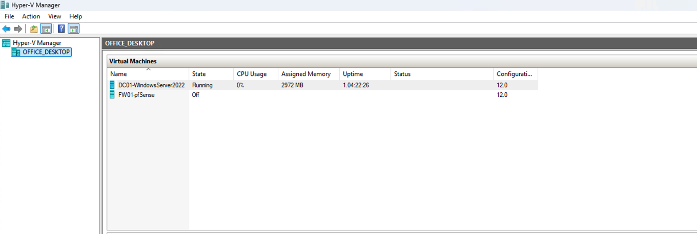

### Virtual Switches
- Network segmentation between external and internal networks.  
- `External` connects pfSense WAN to the Internet.  
- `Internal` connects all internal VMs securely.  
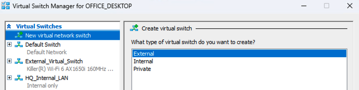

### pfSense Firewall (FW01)
- Firewall/Router  
- Handles NAT, routing, and perimeter security between external and internal networks.  
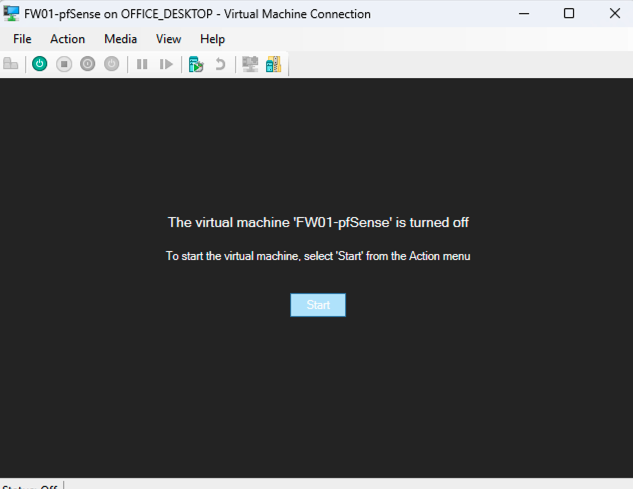 

### Windows Server 2022 (DC01)
- Domain Controller  
- Hosts **Active Directory**, **DNS**, and **DHCP**.  
- Provides centralized identity services for the lab.  
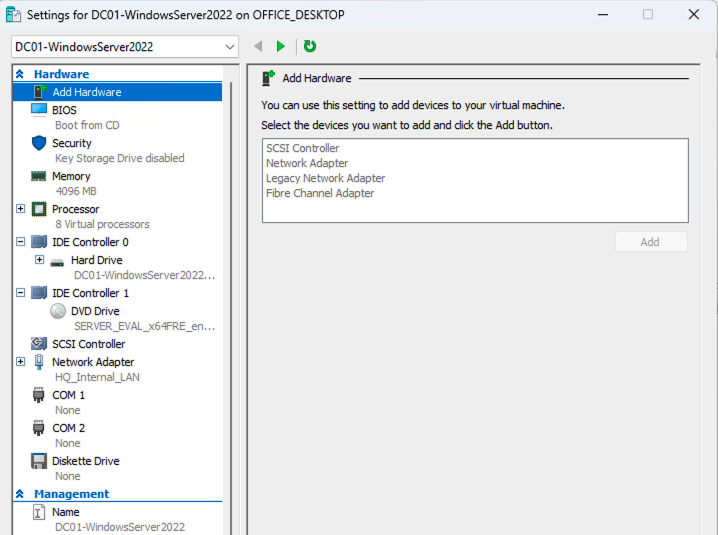

---

## Objectives
- Build a realistic enterprise topology with routing and identity separation.  
- Demonstrate **Active Directory**, **DNS**, and **DHCP** administration.  
- Implement **network segmentation** and **firewall policies**.  

---

## Current Progress
✅ Virtual switches created 
✅ pfSense installed and configured (WAN + LAN)  
✅ Internal LAN operational (10.0.1.0/24)  
✅ Windows Server 2022 installed and statically configured
✅ Domain Services (AD DS) successfully installed
✅ Active Directory Forest created
✅ DHCP and DNS Roles configured
✅ Created Employee Department and Departmental OUs 
✅ Global Groups for specific OUs created
✅ Domain Local Groups created
✅ Nested Global Groups into Domain Local Groups

### Progress Screenshots

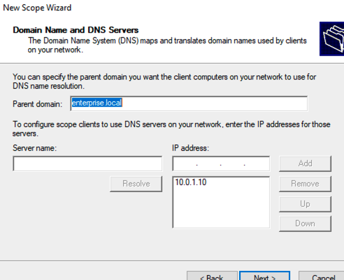
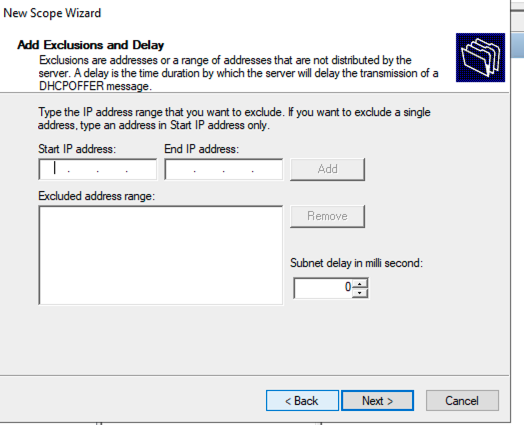
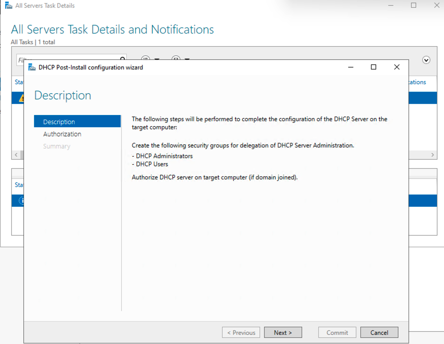
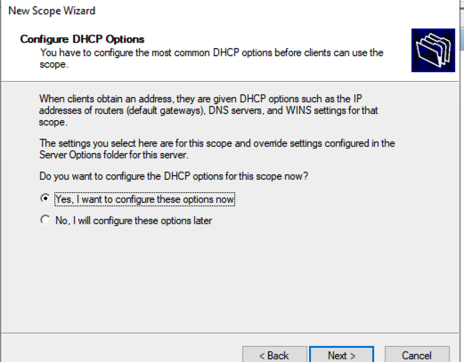
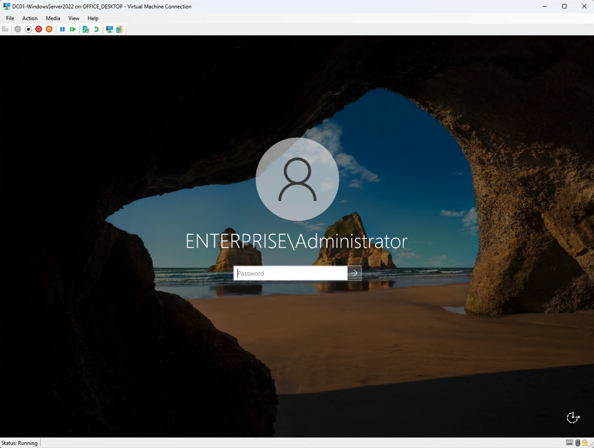
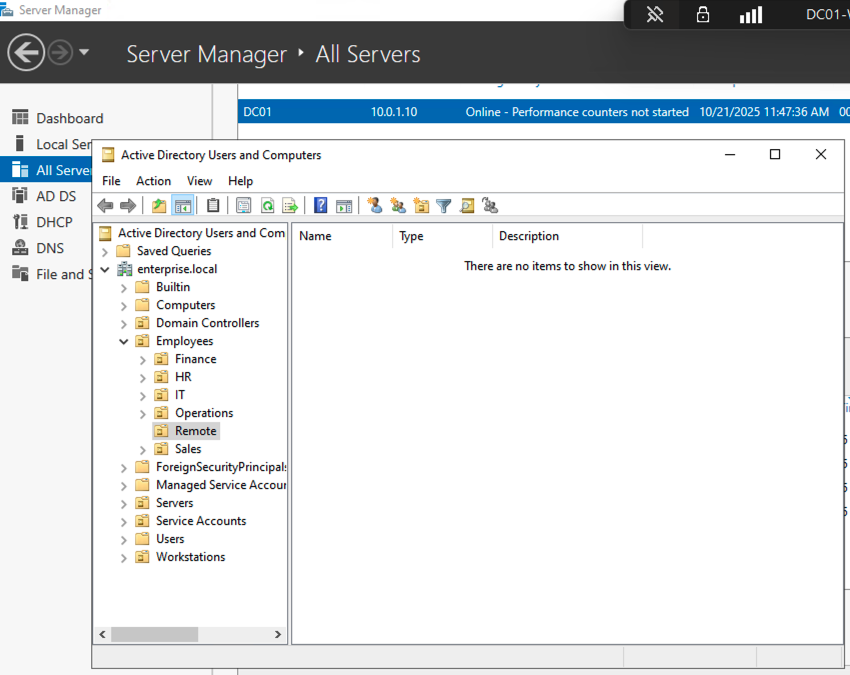
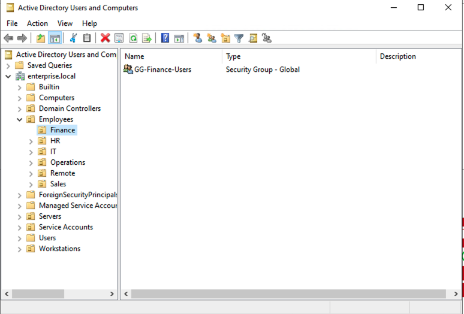
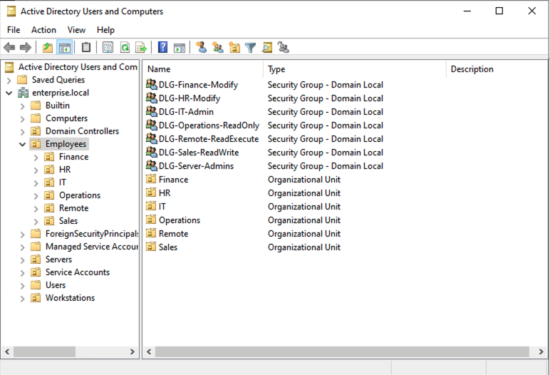

---

## Immediate Next Steps

1. **Bulk-Create Users and Service Accounts via PowerShell**  
   - Automate user provisioning using CSV and PowerShell scripting.  
   - Reinforces automation and real-world administrative practices.
 

---